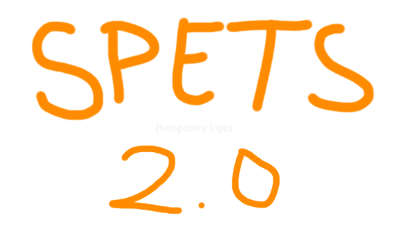

  

# SPETS 2.0

YES!!!!!!

A full C++ rewrite of my, now almost 3 year old, Sprocket import, export, and blueprint editing program. HUGE!

It's still a work in progress so might be a while until r2.0.  
The old source code can be found [in the "old" branch](https://github.com/ArgoreOfficial/SPETS/tree/old/old), as well the [r1.4-32.1 release](https://github.com/ArgoreOfficial/SPETS/releases/tag/r1.4-23.1).

If you would like to contribute or just mess around with the source, clone the project and update submodules. The build.bat script should do this automatically. Just makes sure you have [Git](https://git-scm.com/downloads) installed and in PATH.